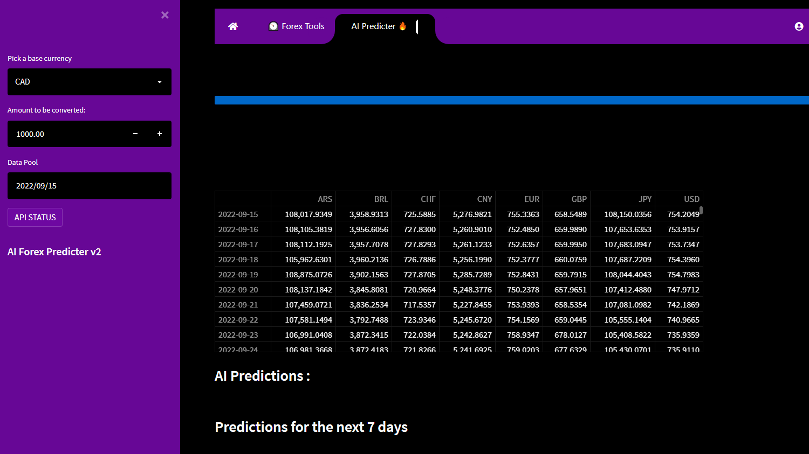
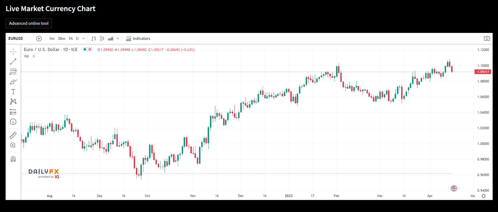

Open Source Strong trading tool that use machine learning to predict future values of currencies conversion supporting ['USD', 'EUR', 'BRL', 'CHF', 'GBP', 'ARS', 'CAD', 'CNY', 'JPY']

It is easy to use :

1 - Pick a base currency  
2 - Pick an amount to be converted  
3 - Pick your Data Pool (a higher data volume = more precision but more calculation time) 

Here some predictions results : 

The app support also a Live Market Currency Chart and some quick information and news:

